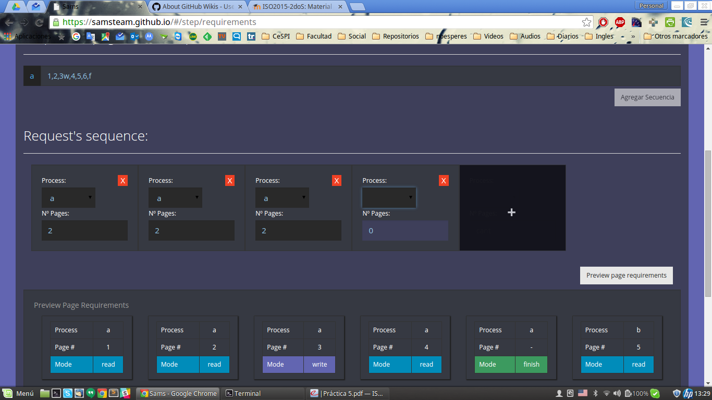
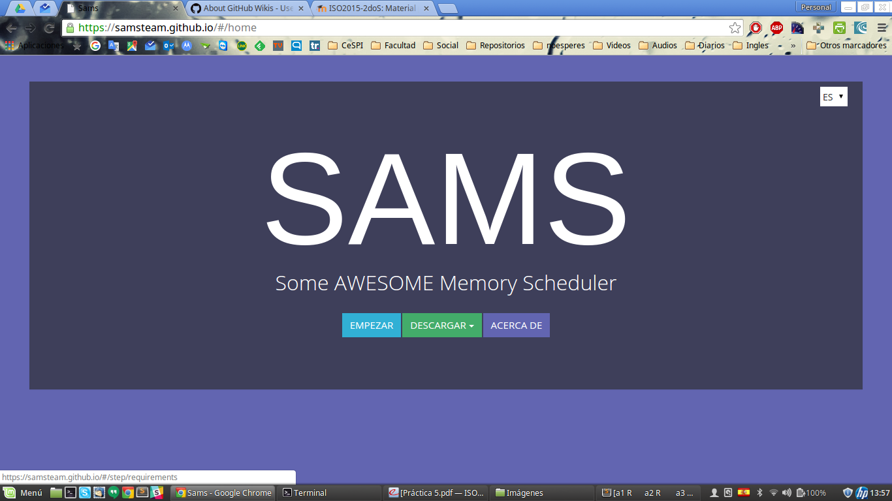
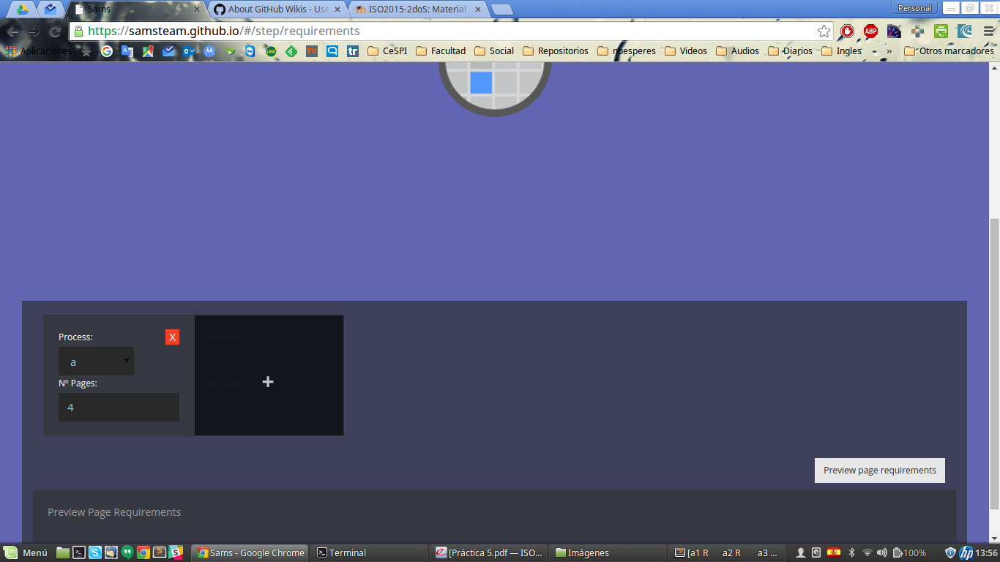
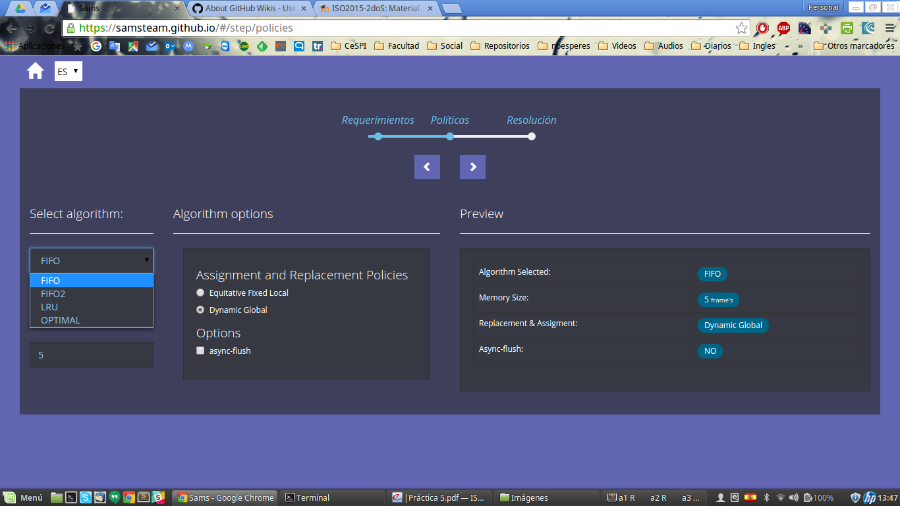
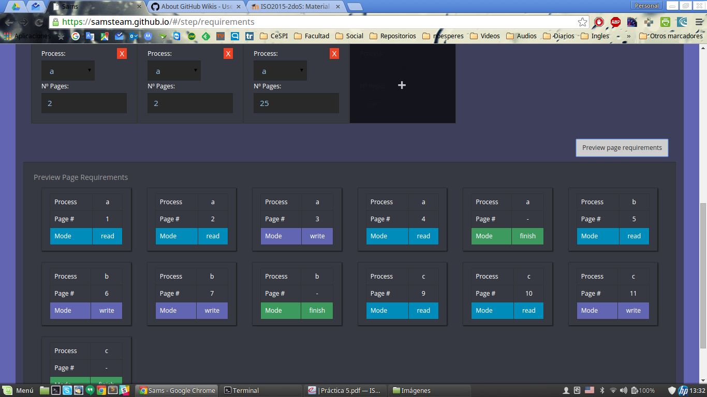
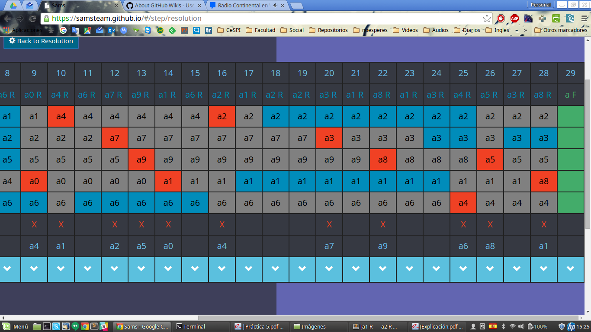
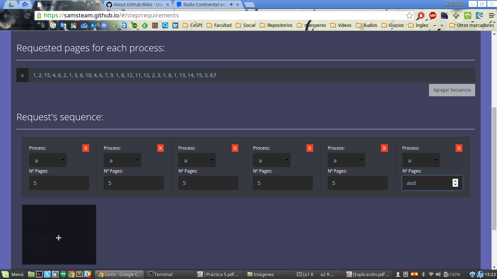
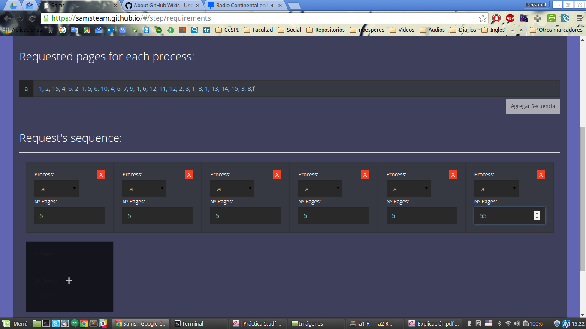
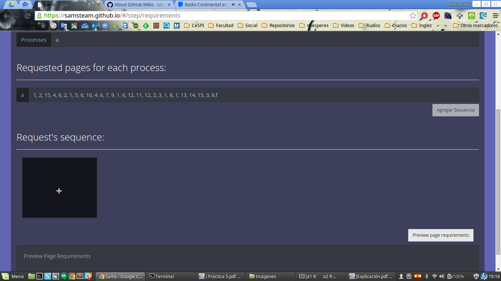

### Issue 1
Al agregar un requerimiento no se actualiza bien para agregar una nueva secuencia.png.

Verificar con **Issue 12**

### Issue 2
Al empezar, reiniciar todos los valores.png

### Issue 3
Como es la sintaxis (ejemplos).png

.png)

### Issue 4
Ocultar al procesar y REVISAR porque a veces queda procesando sin finalizar.png

### Issue 5
Para el reemplazo local y equitativo NO DEJAR FRAMES DESPERDICIADOS (la diferencia de frameses m__nima).png

.png)

### Issue 6
Todas estas configuraciones estan funcionando_.png

### Issue 7
Una vez actualizada la secuencia de requerimientos NO se puede ver el PREVIEW.png

### Issue 8
Validaciones (marca de FIN, etc).png

.png)

### Issue 9
fondo ajustado en lo posible.png

### Issue 10
no permitir ingresar letras.png

### Issue 11
que reemplaze todo el contenido del input al presionar un n__mero.png

### Issue 12
y si figurar todo de una_.png.

Verificar con **Issue 1**

